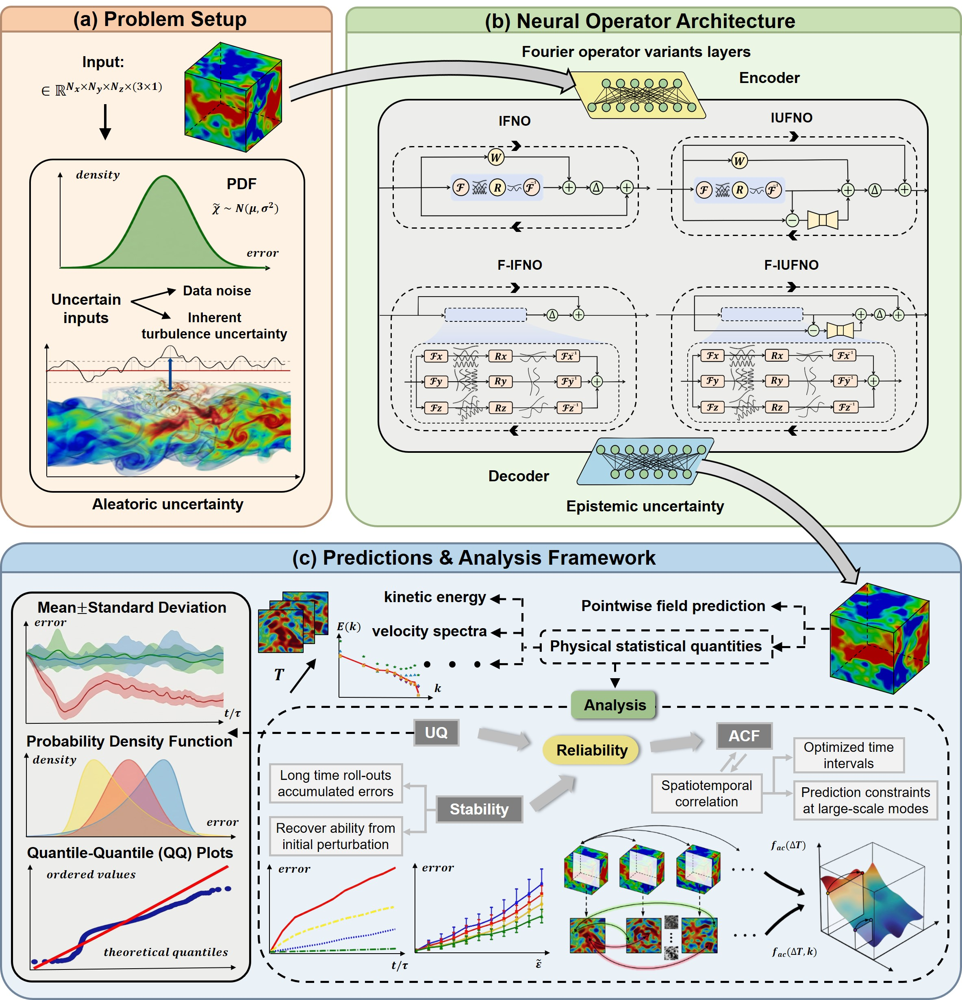

## UQ & Stability of Neural Operators for 3D Turbulence

Code for the paper:
**“Uncertainty quantification and stability of neural operators for prediction of three-dimensional turbulence”**
*Journal of Computational Physics* (2026), 549: 114640. [DOI: 10.1016/j.jcp.2025.114640](https://doi.org/10.1016/j.jcp.2025.114640)

This repository provides PyTorch implementations of several Fourier Neural Operator (FNO) variants and an evaluation pipeline for **uncertainty quantification (UQ)** and **stability** in autoregressive prediction of **3D forced homogeneous isotropic turbulence (HIT)**.
A key practical component is a **prediction spectral constraint** that prevents long-term drift in low-wavenumber energy. A schematic overview of the stdy is shown in the Figure below.


---

## Highlights

- **Models**：IFNO, IUFNO, F-IFNO (proposed), F-IUFNO (proposed)  
- **Reliability analysis**:
  - UQ via error distributions (PDFs), QQ plots, multi-scale error across Fourier modes
  - Stability analysis for long rollouts and sensitivity to initial perturbations
  - ACF-based interpretation of why certain temporal resolutions are more reliable
- **Prediction constraint (optional but recommended)**:
  - Enforce the kinetic energy in the first two Fourier shells (k=1,2) to match reference fDNS during rollouts

---

## Problem Setup (Forced HIT)

- DNS on a periodic box of size $(2\pi)^3$ with resolution $256^3$
- Filtered DNS (fDNS) generated via a sharp spectral cutoff with $k_c=10$, yielding a resolved grid $32^3$
- One-step-ahead learning: input $U_t$ → target $U_{t+\Delta T}$, then autoregressive rollouts for long-term prediction

---

## Requirements

Environment:

- Python >= 3.9
- PyTorch >= 1.12
- numpy, scipy
- h5py
- matplotlib
- pyyaml

Install dependencies:

```bash
pip install -r requirements.txt
```

---

## Datasets

The fDNS dataset used in the paper contains filtered velocity fields with shape:

- Full dataset: **[50 × 600 × 32 × 32 × 32 × 3]** for training, **[30 × 600 × 32 × 32 × 32 × 3]** for post-processing as predictions
- One-step pairs: **29,950** samples (80% train / 20% test)


**Download**:
- The datasets for training, testing and predicting are available on Kaggle: 
  [https://www.kaggle.com/datasets/XintongZou_Cecilie/Dataset4Turbulence](https://www.kaggle.com/datasets/xintongzoucecilie/dataset4turbulence).

**Directory layout**:
```text
correlation/ (acf results)
NOs/ (4 FNO variants)
posteriori analysis/ (reproducible UQ, stability, and acf analysis)
```

---

## Experiments

### 1) Train a neural operator

Example for F_IFNO:

```bash
python F_IFNO_share_decon.py 
```

### 2) Long-term rollout + evaluation

```bash
python FNO_prediction_convert2fortran.py 
```

### 3) UQ & stability analysis

```bash
# error PDF / QQ plot
python Ek_error_pdf_GSfit.py 

# ACF analysis for temporal coherence
python correlation.py
```

---

## Prediction Constraint (Low-k Energy Fix)

During inference, we optionally enforce that the total kinetic energy in the first two Fourier shells (k = 1, 2) matches the reference fDNS values at every rollout step.

High-level logic:

1. FFT the predicted velocity field to Fourier space
2. Compute total kinetic energy $E_k$ for each shell
3. Define rescaling factor $f_k = \sqrt{E^{target}_k / E_k}$ for each shell k=1,2
4. Apply the factor to all Fourier modes in the shell
5. Inverse FFT back to physical space

This constraint is designed to prevent long-horizon drift in large scales while keeping the correction lightweight.

---

## Hyperparameters (Paper Defaults)

The following settings were used as tuned defaults in the paper (per model):

| Model   | Modes | Width | Hidden layers | L2 weight decay | LR   | Factorization ratio γ |
|--------|-------|-------|---------------|-----------------|------|------------------------|
| IFNO   | 12    | 90    | 40            | 1e-8            | 5e-4 | N/A                    |
| IUFNO  | 12    | 90    | 40            | 1e-8            | 5e-4 | N/A                    |
| F-IFNO | 12    | 90    | 40            | 1e-8            | 5e-4 | 4                      |
| F-IUFNO| 12    | 90    | 40            | 1e-8            | 5e-4 | 4                      |

---

## Citation

If you use the models, data, or code for academic research, please cite:

```bibtex
@article{ZOU2026114640,
title = {Uncertainty quantification and stability of neural operators for prediction of three-dimensional turbulence},
journal = {Journal of Computational Physics},
volume = {549},
pages = {114640},
year = {2026},
issn = {0021-9991},
doi = {10.1016/j.jcp.2025.114640},
url = {https://www.sciencedirect.com/science/article/pii/S0021999125009210},
author = {Xintong Zou and Zhijie Li and Yunpeng Wang and Huiyu Yang and Jianchun Wang},
}
```

---

## Questions

If you have questions about the code or data, please open an issue in the GitHub “Issues” section.


